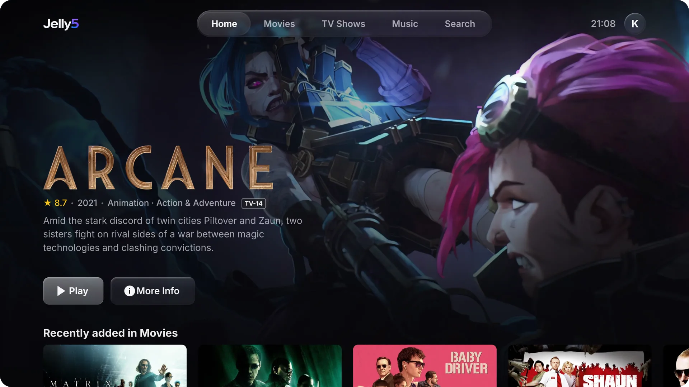
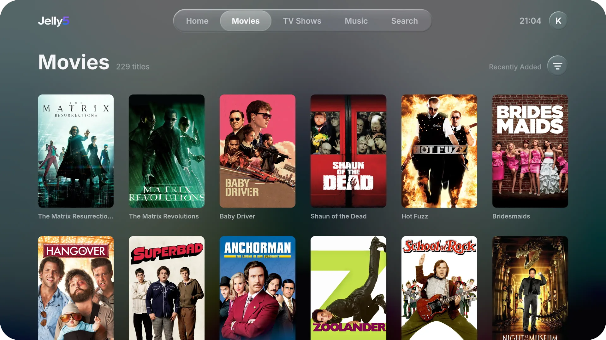
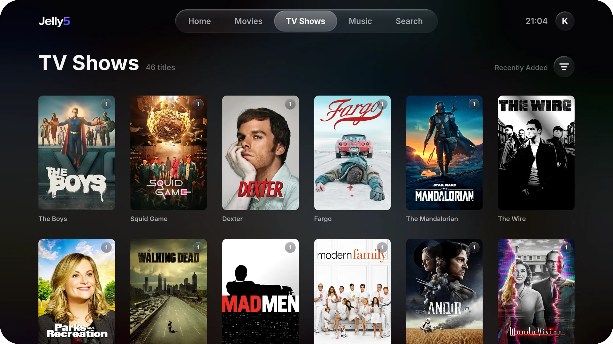
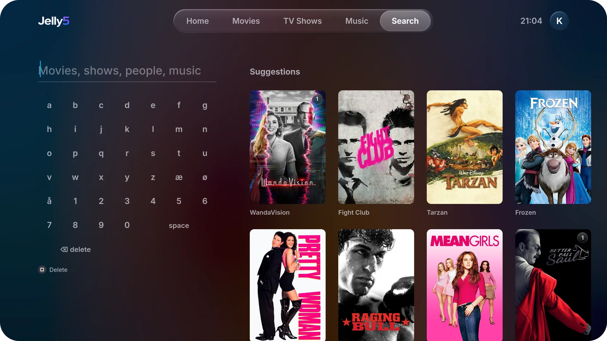

<p align="center">
  <br>
  <b>A native Jellyfin and Emby client for jailbroken PS5 consoles.</b><br>
  Its own GPU-drawn interface, hardware-decoded 4K HDR playback, and no browser in between.
</p>

<p align="center">
  
  
  
  
  
</p>

<p align="center">
  
</p>

<table>
  <tr>
    <td width="33%"></td>
    <td width="33%"></td>
    <td width="33%"></td>
  </tr>
  <tr>
    <td align="center"><sub>Movies</sub></td>
    <td align="center"><sub>TV Shows</sub></td>
    <td align="center"><sub>Search</sub></td>
  </tr>
</table>

Jelly5 brings your Jellyfin or Emby library to the PS5 as a real app: a fast, sharp interface made for the TV, and 4K HDR video played by the console's own hardware. With [Seerr](https://github.com/seerr-team/seerr), you can also request new films and series without leaving the couch.

**Contents:** [Features](#features) · [Installation](#installation) · [Controls](#controls) · [Emby](#emby) · [Seerr](#seerr-optional) · [Formats and limits](#formats-and-limits) · [Troubleshooting](#troubleshooting) · [Privacy](#privacy) · [Building](#building) · [Credits](#credits)

## Features

**Browsing**
- Home with a hero, *Continue watching*, *Next up*, *Recently added*, recommendations and genres
- Title pages with logo art, cast, seasons and episodes, trailers, extras and theme music
- Movie, TV and music libraries with sorting, filters and A–Z jumping, and search across everything
- Several users and servers, a screensaver from your own backdrops, and a liquid-glass look throughout
- In all 27 of the PS5's system languages, following the PS5's language (or a choice in Settings): English, Norwegian, German, French, Spanish, Italian, Portuguese, Dutch, Swedish, Danish, Finnish, Polish, Czech, Hungarian, Romanian, Greek, Russian, Ukrainian, Turkish, Arabic, Japanese, Korean, Chinese (Traditional and Simplified), Thai, Vietnamese and Indonesian

**Playback**
- Hardware-decoded H.264 and HEVC up to 4K with HDR10 and HLG; direct play where the PS5 can, server transcoding where it can't
- Audio and subtitle tracks, subtitle styling and online subtitle search
- Trickplay previews, chapters, *Skip intro*, versions, and auto-play of the next episode
- Playback speed (0.75–2×), audio delay, and a night mode for late evenings
- HDMI bitstream (optional): Dolby Digital, Dolby Digital Plus (with Atmos) and DTS go to your TV or receiver untouched
- Resume and watched state synced with the server, and a maximum quality per server

**Live TV**
- Your server's channels (IPTV/M3U or a tuner) in a programme guide: what's on now and next, filters for favourites, films, sport, news, kids and series, and a line where it is now
- *Live now* on the home screen, and the guide opens on the channel you watched last
- Change channel with L1/R1 while watching, a channel list with what's on each (△), and back to the previous channel
- Record a programme or every episode of a series, and watch your recordings (where the server records and your account may)

**Music**
- Albums, artists, playlists and Instant Mix, playing on while you browse
- *Now playing* with a queue, shuffle, repeat and time-synced lyrics

**Made for the PS5**
- DualSense adaptive triggers for scrubbing, and a light bar that takes the colour of what's playing
- A 120 Hz interface where the TV supports it, and TV-remote control over HDMI-CEC
- *Watch together* (Jellyfin SyncPlay) and remote control from other Jellyfin or Emby apps

**Requests with Seerr** (optional)
- Search, request and track films and series, a *Discover* tab, and trailers as a QR code for your phone

## Installation

### What you need

- A **jailbroken PS5** that can load payloads, with **ShadowMount+**:

  | Firmware | Jailbreak | Status |
  | --- | --- | --- |
  | 11.60 | Poops | Tested |
  | 13.60 | Relapse | Works (reported by a user) |

  Other firmware with the same tools should work too. If yours does (or doesn't), open an issue.
- A way to copy files to the console: **[ps5upload](https://github.com/phantomptr/ps5upload)** (recommended), or FTP (**ftpsrv** on port 2121 or **etaHEN** on 1337) with a client such as FileZilla.
- A **Jellyfin** server (tested with 12.1) or an **Emby** server (tested with 4.10) that the PS5 can reach.

### Install

1. Download `Jelly5-<version>.zip` from the [latest release](../../releases/latest) and unzip it. Inside is a folder called `PPSA99505`.
2. Start the jailbreak with ShadowMount+ (and your FTP server, if you use FTP).
3. Upload the `PPSA99505` folder to `/data/homebrew/` on the console, so that `/data/homebrew/PPSA99505/eboot.bin` exists. Create `/data/homebrew` first if it isn't there.
4. After a moment, ShadowMount+ adds a **Jelly5** tile under *Media* on the home screen. If it doesn't, run your payloads again, or reboot and jailbreak again.
5. Open Jelly5, pick your server from the list or type its address (for example `192.168.1.20:8096`), and sign in. On Jellyfin, **Quick Connect** is quickest: scan the QR code with your phone and tap *Authorize*.

Jelly5 remembers your accounts. Add more users and servers from the profile picker.

The zip also holds `PPSA99505.ffpfsc`, the same app as a PFS image for loaders that mount images; the folder is the tested route.

### Update

1. **Close Jelly5 completely first** (PS button, then close it). Replacing files under a running app can crash the console.
2. Upload the new folder's files **over** the old ones in `/data/homebrew/PPSA99505/`.

Don't delete the old folder and copy in a new one, and never keep a second folder with the same ID under `/data/homebrew`: ShadowMount+ mounts the folder, and replacing it breaks the mount. Your accounts and settings are kept.

### Uninstall

Close Jelly5 and delete `/data/homebrew/PPSA99505`. Its accounts, settings and image cache live in the app's own data (`/download0/jelly5`); nothing else on the console is touched.

## Controls

| Button | In the menus | In the player |
| --- | --- | --- |
| ✕ | Select | Play / pause, select |
| ○ | Back | Hide the controls, then leave the player |
| D-pad | Move | Show the controls; left/right seek 10 s |
| L1 / R1 | Previous / next tab | Previous / next chapter (Live TV: channel) |
| L2 / R2 | Previous / next letter (A–Z libraries) | Rewind / fast forward, faster the harder you press |
| △ | Search | Episodes (on a film: chapters; Live TV: channels) |
| □ | Sort and filter (libraries); favourite channel (guide) | Audio and subtitles |
| Options | Options for the selected title | The controls |
| Touchpad | *Now playing*, while music plays | The controls |
| L3 | | Playback info |

With HDMI Device Link on the PS5 and CEC on the TV, the TV remote works too: OK is ✕ and Back is ○.

In the Live TV guide, ✕ on what's on now watches the channel, ✕ on a later programme offers to record it, and Options opens the same choices on anything (also on a channel). ○ goes back to now, then to the top.

## Emby

Jelly5 detects whether a server is Jellyfin or Emby, and the same screens work on both. It needs no Emby Premiere. On Emby:

- You sign in with user name and password (Emby has no Quick Connect).
- *Watch together*, lyrics and Jellyfin's home-screen order aren't available.
- *Skip intro* uses Emby's intro markers, which Emby only creates with Premiere.
- Scrubbing previews need *Thumbnail image extraction* turned on in the library's settings.
- Without Premiere, Emby transcodes in software and without HDR tone mapping, so Dolby Vision profile 5 may show off colours.
- With Premiere, each PS5 user counts as one of Emby's devices.
- Behind a reverse proxy that serves Emby under `/emby`, the plain address is enough: Jelly5 tries `/emby` itself.
- Live TV needs Emby Premiere: without it, Emby lists no channels and the *Live TV* tab stays away.

Versions before 0.4.0 don't know Emby; update if an Emby account doesn't connect.

## Seerr (optional)

With [Seerr](https://github.com/seerr-team/seerr) (the successor of Overseerr and Jellyseerr) 3.4 or newer, Jelly5 shows what your library is missing and lets you request it. Seerr needs Jellyfin or Emby as its media server, your user imported, and permission to request.

Turn it on under *Settings* (your picture, top right) → *Seerr*:

| Setting | |
| --- | --- |
| **Address** | Seerr's address on your network, e.g. `http://192.168.1.20:5055`. A public domain that only works from outside your home won't work from the PS5. |
| **Sign-in** | *Automatic*: approve once, and Seerr signs in through your Jellyfin account from then on (Quick Connect must be on in Jellyfin). Or your *Jellyfin* / *Emby password*, or a *Seerr account*, typed once. Only Seerr's session is stored, never a password. On Emby the session lasts 30 days, then the PS5 asks you to sign in again. |
| **Test connection** | Checks the address, the session and the pictures. |

Once signed in, Seerr's results appear in Search, a *Discover* tab shows what's trending and upcoming, and title pages offer *Request*. A series you have only part of offers *Request more seasons* under Options on a season or an episode. Seerr's own "hide available / requested" settings apply. Separate 4K Radarr/Sonarr servers aren't offered.

## Formats and limits

| | Plays | Notes |
| --- | --- | --- |
| Video | H.264, HEVC (Main, Main 10), VP9 and older formats | AV1 is transcoded by the server |
| HDR | HDR10, HLG, HDR10+ (as HDR10), Dolby Vision (its HDR10 base layer) | Dolby Vision profile 5 is transcoded |
| Audio | AAC, AC3, E-AC3, TrueHD, DTS (incl. DTS-HD MA), FLAC, Opus, MP3 and more | Played as multichannel PCM; with *HDMI bitstream* on, Dolby Digital, Dolby Digital Plus and DTS go to the TV/receiver as they are (TrueHD and DTS-HD MA stay lossless PCM) |
| Subtitles | SRT, ASS/SSA, PGS, DVD and DVB, WebVTT | Embedded or external |
| Containers | MKV, MP4, TS/M2TS, AVI and more | No Blu-ray folders or ISO files |
| Live TV | Channels from the server's tuners (IPTV/M3U, HDHomeRun) as MPEG-TS or HLS | Played directly where the PS5 can; interlaced (1080i, 576i) and MPEG-2 channels are deinterlaced and converted by the server. No pausing back in time (timeshift) |

Limits of the platform, not of Jelly5:

- HDMI bitstream covers Dolby Digital, Dolby Digital Plus (Atmos in DD+) and DTS core, when the TV or receiver supports them. TrueHD (incl. its Atmos) and DTS-HD MA/DTS:X play as lossless 7.1 PCM.
- No true 24p output: the display runs at 60 or 120 Hz.
- No 3D: side-by-side and top-and-bottom files are refused, and 3D Blu-ray (MVC) plays in 2D.
- The app can't quit itself: close it with the PS button.

## Troubleshooting

| Problem | What to do |
| --- | --- |
| No Jelly5 tile | Check the path is exactly `/data/homebrew/PPSA99505/eboot.bin`, then rerun ShadowMount+ or reboot and jailbreak again. |
| The upload fails ("Text file busy") | Jelly5 is still running: close it first. |
| Your server isn't listed | Type its address. Discovery needs UDP port 7359; in Docker, publish `7359/udp`, and in Jellyfin turn on *Enable auto discovery*. |
| No previews when scrubbing | The server makes them. Jellyfin: turn on *Enable trickplay image extraction* in the library and run *Generate Trickplay Images*. Emby: turn on *Thumbnail image extraction*. |
| A title won't play or stutters | Press **L3** while it plays and include that info in an issue. Over Wi-Fi, lower *Maximum quality* in the settings. |
| The receiver shows PCM, not Dolby or Atmos | Turn on *Settings → HDMI bitstream* (and night mode off). TrueHD and DTS-HD MA always play as PCM: see *Formats and limits*. |
| Seerr isn't answering | Use Seerr's local address (port 5055 by default) and check it with *Test connection*. |
| Seerr's automatic sign-in fails | Seerr is older than 3.4, Quick Connect is off in Jellyfin, or your user isn't in Seerr. Use your password instead, or import the user. |
| Seerr shows no pictures | Seerr fetches them from TMDB, so the Seerr server needs internet access. |

**Reporting a problem:** open an issue with your firmware, your server and its version, what you did and what happened. For playback problems, the L3 playback info helps a lot.

## Privacy

Jelly5 talks to your Jellyfin or Emby server and, if you turn it on, your Seerr server, and nothing else. It never contacts TMDB, YouTube or other services: posters come through Seerr's image cache, and trailers are a QR code your phone opens. The only exception is opt-in: with *Check for updates* on, it asks GitHub once per launch whether there's a newer release. It keeps its accounts, settings, Seerr session (never a password) and a 96 MB image cache in its own folder, and release builds send no logs anywhere.

## Building

Jelly5 builds on macOS (Apple silicon or Intel) and Linux with the [PS5 payload SDK](https://github.com/ps5-payload-dev/sdk) and pacbrew, which `scripts/setup-toolchain.sh` downloads (pinned by checksum) into the git-ignored `toolchain/` folder. First install:

- **macOS**: `brew install llvm lld coreutils bash nasm meson ninja pkgconf` (the system's bash 3.2 is too old for the build script).
- **Linux** (Debian/Ubuntu): `sudo apt install build-essential clang lld llvm curl unzip zip python3-venv nasm meson ninja-build pkg-config`. clang, lld and llvm must be the same version (tested with LLVM 21); set `LLVM_CONFIG` (e.g. `llvm-config-21`) if several are installed.

```sh
scripts/setup-toolchain.sh                  # once: SDK, pacbrew sysroot, host zlib, AV1 (dav1d + FFmpeg 7.1)
cd app
eval "$(../scripts/setup-toolchain.sh --env)"
scripts/build.sh --release                  # → build/app/Jelly5-<version>.zip
```

On macOS, run the build with Homebrew's bash: `"$(brew --prefix)/bin/bash" scripts/build.sh`.

A plain `scripts/build.sh` is a development build: it reads the git-ignored `.env.local` (`JF_URL`, `PS5_HOST`, …), uses `JF_URL` as the default server, and sends a debug log over UDP to the build machine (`scripts/log.sh`). `scripts/deploy.py` uploads it to the console over FTP.

Tests run on the build machine (they need libcurl's headers: `libcurl4-openssl-dev` on Debian/Ubuntu, included with macOS):

- `app/tests/host/run.sh`: the client against your Jellyfin server (`JF_URL`, `JF_USER`, `JF_PASS` in `.env.local`); `run.sh emby` against Emby (`EMBY_URL`, `EMBY_USER`, `EMBY_PASS`)
- `app/tests/host/seerr.sh`: the Seerr client (`SEERR_URL`); it sends no request unless given `--for-real`
- `app/tests/host/routes.sh`: no server needed; checks that every Jellyfin request is the same as on `main`

## Credits

Jelly5 stands on the work of others in the PS5 scene and beyond:

- **[Nuvio PS5](https://github.com/theghostonline/Nuvio-PS5)** by Husam Osman: the native player, its session and subtitle handling, and the app packaging toolkit
- **[EVO Player](https://github.com/sainsaji/EVO-PLAYER-PS5)**: the media engine (demuxing, `sceVideodec2`, the AGC renderer, audio, HDR), shader tooling and much of what is known about the PS5's GPU from user space
- **[ps5-payload-dev SDK](https://github.com/ps5-payload-dev/sdk)** by John Törnblom and contributors, plus the pacbrew sysroot
- **[Jelly5-Seerr](https://github.com/viviandsx/Jelly5-Seer)** by [@viviandsx](https://github.com/viviandsx): the Seerr integration (client, search, requests, Discover) and the Linux build. Thank you!
- **[Switchfin](https://github.com/dragonflylee/switchfin)**, a reference for the Jellyfin API
- **[OverShifted/LiquidGlass](https://github.com/OverShifted/LiquidGlass)** (MIT), whose refraction profile the glass shader follows
- [FFmpeg](https://ffmpeg.org), [libass](https://github.com/libass/libass), FreeType, HarfBuzz, [cJSON](https://github.com/DaveGamble/cJSON), [NanoSVG](https://github.com/memononen/nanosvg), [QR Code generator](https://www.nayuki.io/page/qr-code-generator-library) by Project Nayuki, the [Unicode CLDR](https://cldr.unicode.org) (dates and language names), and the Inter, Roboto and Noto typefaces
- The [Jellyfin](https://jellyfin.org) project, [Seerr](https://github.com/seerr-team/seerr), and [Emby](https://emby.media)'s API documentation ([Emby.SDK](https://github.com/MediaBrowser/Emby.SDK))

Every component, its licence and where it is used are listed in [`THIRD_PARTY_NOTICES.md`](THIRD_PARTY_NOTICES.md).

## License

Jelly5 is free software under the **GNU General Public License v3.0 or later** (see [`LICENSE`](LICENSE)). Code taken from Nuvio PS5, EVO Player and other projects keeps its original notices.

## Disclaimer

Jelly5 is an unofficial homebrew project, provided **as is, without any warranty** of any kind, express or implied, as set out in sections 15 and 16 of the GPL. **You use it entirely at your own risk.** The authors and contributors are not responsible or liable for any damage, data loss, malfunction, account or online-service consequences, or any other harm, to your console, your devices, your data or anything else, arising from installing, using or being unable to use it.

Running homebrew requires a jailbroken console, which may break Sony's terms of service and void your warranty. Whether you do so is your choice and your responsibility.

Jelly5 contains no media and gives access to no content of its own: it plays what is on your own Jellyfin or Emby server. Use it only with media you have the right to watch.

Jelly5 is not affiliated with or endorsed by Sony Interactive Entertainment, the Jellyfin project or Emby LLC. *PlayStation*, *PS5* and *DualSense* are trademarks of Sony Interactive Entertainment Inc. *Emby* is a trademark of Emby LLC.
