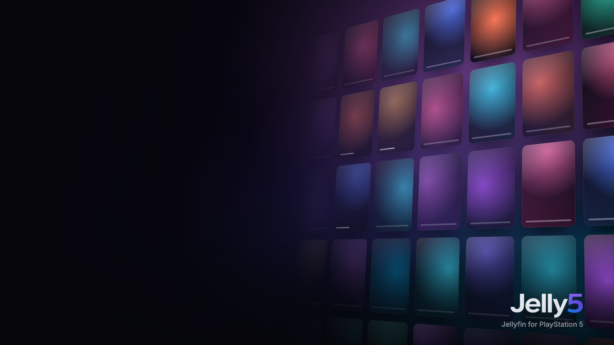

<p align="center">
  
</p>

<p align="center">
  <br>
  <b>A native Jellyfin client for jailbroken PS5 consoles.</b><br>
  Its own GPU-drawn interface in the spirit of Netflix and Apple TV, hardware-decoded 4K HDR playback, and no browser in between.
</p>

<p align="center">
  
  
  
  
</p>

---

## What it is

Jelly5 is an app that appears on the PS5 home screen under **Media**, next to
Netflix and friends. Everything you see is drawn directly on the GPU at the
panel's own resolution: large backdrops, rows that slide and lift, blur and
glass, artwork that fades in over its BlurHash. Video goes through the console's
own hardware decoder.

It speaks only Jellyfin. There is no extra backend and no account other than
your Jellyfin server.

## Features

**Browsing**
- Home with a hero, *Continue watching*, *Next up*, *Recently added* per library, recommendations and genres
- Libraries for movies, shows, music and collections, with sorting, filters and remembered focus
- Detail pages with logo art, cast, seasons and episodes, trailers, extras and *More like this*
- Search across movies, shows, episodes, music and people
- Several users and servers, with profile pictures, plus a screensaver drawn from your own library's backdrops

**Signing in**
- **Quick Connect** by default: scan the QR code with your phone, tap *Authorize*, and you are in
- Or sign in with user name and password using the PS5's system keyboard

**Playback**
- Hardware decoding of H.264 and HEVC, including 4K HDR10 (Dolby Vision plays its HDR10 base layer)
- Direct play where possible, with server transcoding when needed, through a PS5 device profile
- Audio and subtitle tracks (SRT/ASS/PGS), with subtitle style settings and online subtitle search
- Trickplay thumbnails, chapters on L1/R1, *Skip intro*/*Skip credits* from Jellyfin's media segments, and auto-play of the next episode
- Choice between versions when an item has several
- Progress, resume and watched state synced with Jellyfin

**Music**
- Albums, artists, playlists and Instant Mix
- Background playback while you browse, with a mini player and a full *Now playing* view with lyrics

**PS5 touches**
- The DualSense light bar follows the colours of what is playing
- A 120 Hz interface on displays that support it
- *Watch together* (Jellyfin SyncPlay) and remote control from other Jellyfin apps
- Norwegian and English interface

## Requirements

- A jailbroken PS5 with **ShadowMount+** and an FTP server (for example ftpsrv or etaHEN's). Tested on firmware **11.60**.
- A Jellyfin server (developed against 12.1) on the same network or reachable from the console.

## Install

1. Download `Jelly5-<version>.zip` from the latest release and unzip it.
2. Over FTP, copy the `PPSA99505` folder to `/data/homebrew/` on the console,
   so that you have `/data/homebrew/PPSA99505/eboot.bin`.
3. ShadowMount+ mounts it and adds the **Jelly5** tile under Media. If the tile
   doesn't show up, rerun your payloads or reboot and jailbreak again.
4. Open Jelly5, enter your server address and sign in with Quick Connect.

The zip also has `PPSA99505.ffpfsc`, a PFS image of the same app for loaders
that mount images. The folder route above is the tested one.

**Updating:** close Jelly5 completely first (PS button → close the app), then
overwrite the files in `/data/homebrew/PPSA99505/`. Don't delete the folder and
copy a new one, and never keep a second folder with the same title ID anywhere
under `/data/homebrew`: ShadowMount+ bind-mounts the folder, and replacing it
breaks the mount. Replacing files while the app is running can crash the
console.

## Controls

| Button | In the menus | In the player |
| --- | --- | --- |
| ✕ | Select | Play / pause, select |
| ○ | Back one level at a time | Hide the controls, then leave the player |
| D-pad | Move | Show the controls; left/right seek in 10 s steps (faster when held) |
| L2 / R2 | | Rewind / fast forward |
| L1 / R1 | | Previous / next chapter |
| △ | Search | Episodes (a film: its chapters) |
| □ | Sort & filter (in the libraries) | Audio and subtitles |
| Options | Options for the selected title (watched, favourite, …) | Audio, subtitles, versions and more |
| Touchpad | Open *Now playing* while music plays | Audio, subtitles, versions and more |

## Known limits

These come from the platform, not from Jelly5:

- No bitstream passthrough: Dolby Atmos and DTS:X play as 7.1 PCM.
- No true 24p output: the console runs the display at 60 or 120 Hz.
- Dolby Vision plays its HDR10 base layer. Profile 5, which has none, is transcoded by the server.
- AV1 is transcoded by the server for now.
- The app can't quit itself. Close it with the PS button.

## Building

Jelly5 builds natively on macOS (Apple silicon) with the
[PS5 payload SDK](https://github.com/ps5-payload-dev/sdk) and pacbrew.

```sh
scripts/setup-toolchain.sh                  # once: SDK, pacbrew sysroot, host tools
cd app
eval "$(../scripts/setup-toolchain.sh --env)"
"$(brew --prefix)/bin/bash" scripts/build.sh --release   # → build/app/Jelly5-<version>.zip
```

A plain `scripts/build.sh` is the development build. It reads the git-ignored
`.env.local` (`JF_URL`, `PS5_HOST`, …), uses `JF_URL` as the default server,
and sends a debug log over UDP to your Mac (`scripts/log.sh`). `scripts/deploy.py`
uploads it to the console over FTP. `--release` leaves all of that out.

The project's layout and its hard-won rules are in [`CLAUDE.md`](CLAUDE.md), and
the decisions and design plan are in [`PLAN.md`](PLAN.md). `concept/` holds the
interactive HTML prototype the interface is built from.

## Credits

Jelly5 stands on the work of others in the PS5 scene and beyond:

- **[Nuvio PS5](https://github.com/theghostonline/Nuvio-PS5)** by Husam Osman: the native player, its session and subtitle handling, and the app packaging toolkit
- **[EVO Player](https://github.com/sainsaji/EVO-PLAYER-PS5)**: the media engine (demuxing, `sceVideodec2`, the AGC renderer, audio, HDR), shader pipeline tooling and much of what is known about the PS5's GPU from user space
- **[ps5-payload-dev SDK](https://github.com/ps5-payload-dev/sdk)** by John Törnblom and contributors, plus the pacbrew sysroot
- **[Switchfin](https://github.com/dragonflylee/switchfin)**, used as a reference for the Jellyfin API
- [FFmpeg](https://ffmpeg.org), [dav1d](https://code.videolan.org/videolan/dav1d), [libass](https://github.com/libass/libass), FreeType, HarfBuzz, [cJSON](https://github.com/DaveGamble/cJSON), [NanoSVG](https://github.com/memononen/nanosvg), [QR Code generator](https://www.nayuki.io/page/qr-code-generator-library) by Project Nayuki, and the Inter, Roboto and Noto typefaces
- The [Jellyfin](https://jellyfin.org) project

Third-party licences are listed in
[`toolkit/NUVIO_THIRD_PARTY_NOTICES.md`](toolkit/NUVIO_THIRD_PARTY_NOTICES.md) and
next to the bundled fonts in `app/assets/fonts/`.

## License

Jelly5 is free software under the **GNU General Public License v3.0 or later**
(see [`LICENSE`](LICENSE)). Code taken from Nuvio PS5, EVO Player and other
projects keeps its original notices.

Jelly5 is not affiliated with Sony Interactive Entertainment or the Jellyfin
project. *PlayStation* and *PS5* are trademarks of Sony Interactive
Entertainment. Use it only with media you are entitled to play.
